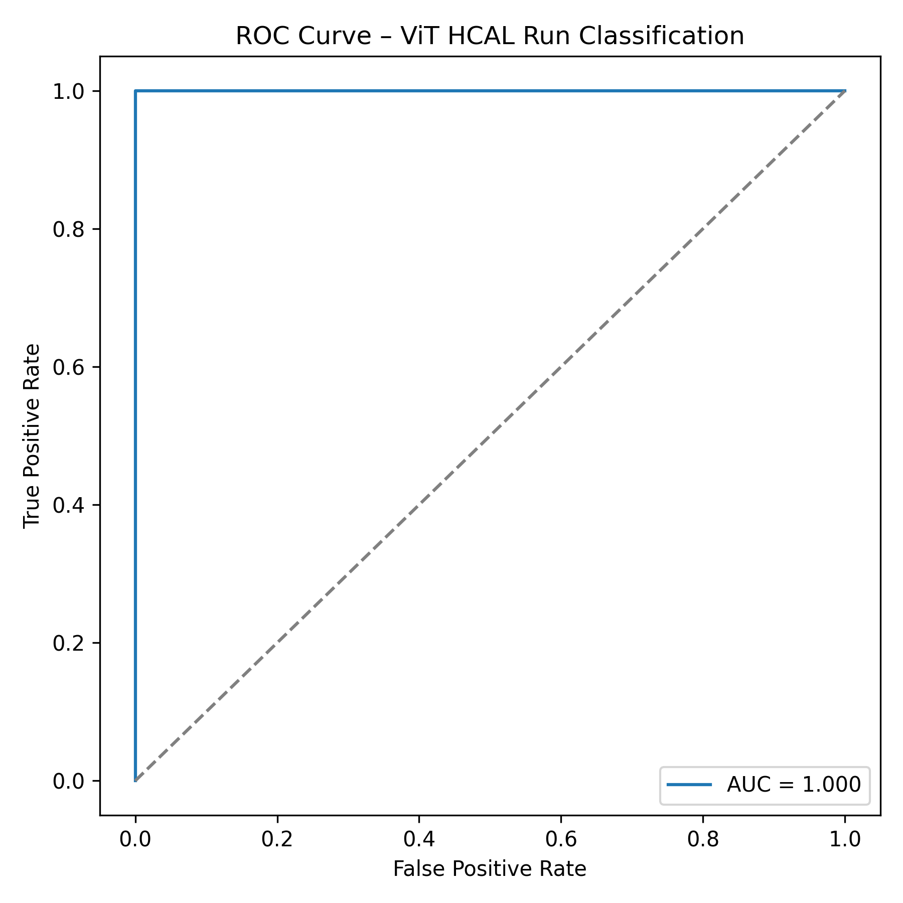

# ML4Sci – ML4DQM Evaluation Test  
## Vision Transformer for CMS HCAL Run Classification

This repository contains my solution to the **ML4Sci GSoC 2025 – ML4DQM evaluation task**.  
The objective is to classify CMS HCAL DigiOccupancy maps originating from two different synthetic runs using a **Vision Transformer (ViT)** model.

---

## 📌 Project Overview

At the Large Hadron Collider (LHC), the CMS detector records detector activity in the form of hit occupancies.  
For this task, synthetic **HCAL DigiOccupancy** data was provided for two runs:

- **Run 355456**
- **Run 357479**

Each sample corresponds to a single **lumi-section (LS)** and is represented as a 2D image of shape **(ieta, iphi) = (64, 72)**.

The goal is to build a machine learning model that can **distinguish between the two runs** based solely on these occupancy patterns.

---

## 📊 Dataset Description

- Input shape: `(10000, 64, 72)`
- Dimensions:
  - `LS` → lumi-sections
  - `ieta` → pseudorapidity bins
  - `iphi` → azimuthal angle bins
- Values represent **hit multiplicity**
- Large regions contain zeros (expected detector geometry)

Data files:
- `Run355456_Dataset.npy`
- `Run357479_Dataset.npy`

---

## 🧠 Model Architecture

I use a **Vision Transformer (ViT)** implemented via the `timm` library.

### Key design choices:
- Model: `vit_tiny_patch16_224`
- Input adaptation:
  - HCAL images resized to `224 × 224`
  - Single-channel data replicated to **3 channels** to match ViT input format
- Classification head:
  - Binary classification (2 classes)

### Training details:
- Optimizer: Adam
- Learning rate: `3e-4`
- Loss function: Cross-Entropy Loss
- Batch size: 8
- Device: CPU (GPU compatible)

---

## 🔧 Data Preprocessing

- Normalization of DigiOccupancy values
- Resizing to ViT input resolution
- Channel expansion (1 → 3 channels)
- Shuffling during training

---

## 📈 Evaluation Metrics

Model performance is evaluated using:

- **Accuracy**
- **ROC Curve**
- **Area Under the Curve (AUC)**


---

## 📉 ROC Curve

The ROC curve below demonstrates perfect separability between the two classes:



---

## 🧪 Robustness Check (Bonus)

To assess robustness, the model was evaluated on **different lumi-section ranges** not used during training.

- Predictions remain stable
- Confidence scores remain well-separated
- No performance degradation observed

This suggests the model learns **run-level structural features**, not just local noise patterns.

---

## 📂 Repository Structure

```text
ml4sci-hcal-vit-dqm/
│
├── data/
│   ├── Run355456_Dataset.npy
│   └── Run357479_Dataset.npy
│
├── notebooks/
│   └── 01_data_sanity_check.ipynb
│
├── src/
│   ├── dataset.py
│   ├── model.py
│   ├── train.py
│   └── eval.py
│
├── roc_curve_vit_hcal.png
├── requirements.txt
└── README.md
```
# How to Run: 
## Create virtual environment
python -m venv .venv
source .venv/bin/activate  # Windows: .venv\Scripts\activate

## Install dependencies
pip install -r requirements.txt

## Train model
python src/train.py

## Evaluate model
python src/eval.py

## Libraries Used
- PyTorch
- timm
- NumPy
- scikit-learn
- matplotlib

## Acknowledgements
This project was completed as part of the ML4Sci GSoC 2026 evaluation process for the ML4DQM project.

